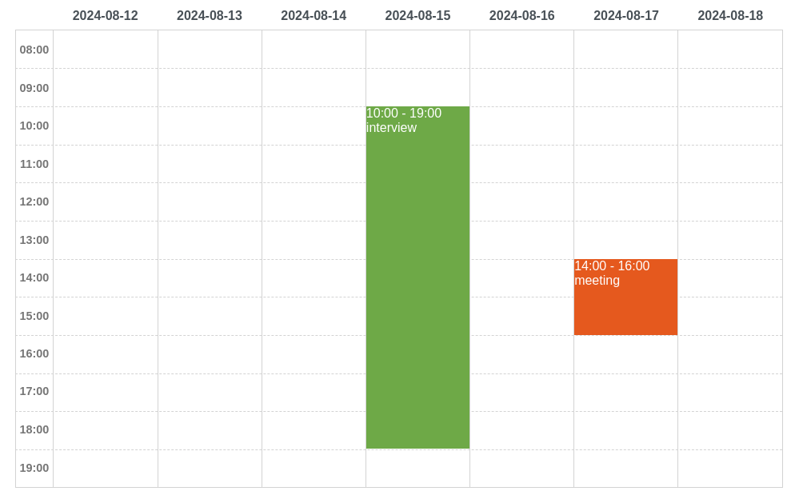
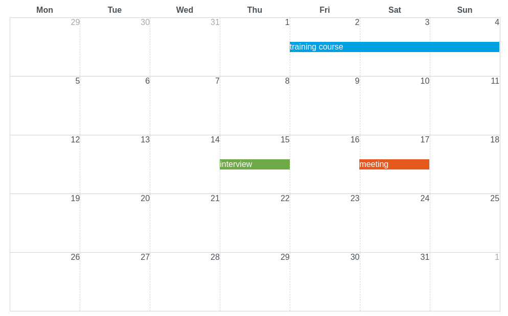

# jscheduler_ui

An simple **scheduler component** written in javascript. 

week view                 | month view
:-------------------------:|:-------------------------:
 | 

[Demo](https://mormat.github.io/jscheduler_ui/) -
[Examples](https://mormat.github.io/jscheduler_ui/examples.html)

It doesn't require a specific framework and can be embedded in any HTML page (like a legacy website for instance) and from npm as well.

- Switch between multiple views: `day`, `week` and `month`
- Drag and drop events
- Resize events
- Helpers functions to navigate back and forward
- No dependencies required

## Quick start


Add the lines below in your HTML page


```html
<!DOCTYPE html>
<html>
  <body>
    <h4>jScheduler</h4>
    <div id="scheduler"></div>
    <script src="https://unpkg.com/@mormat/jscheduler_ui"></script>
    <script>
      var element = document.getElementById('scheduler');

      var events = [
        { start: "2024-09-16 10:00", label: "interview" },
        { start: "2024-09-17 14:00", label: "meeting" }
      ];

      jscheduler_ui.render(element, events);        
    </script>
  </body>
</html>
```

## Installation

Download `jscheduler_ui.js` and `jscheduler_ui.css` in the last [release](https://github.com/mormat/jscheduler_ui/releases)

Then import the `.css` file in your html page.

```html
<link rel="stylesheet" href="./jscheduler_ui.css">
```

and the `.js` file.
```html
<script src="jscheduler_ui.js"></script>
```


### Using [unpkg](https://unpkg.com/)

To include the `.css` script
```html
<link 
    rel="stylesheet" 
    href="https://unpkg.com/@mormat/jscheduler_ui/dist/jscheduler_ui.css"
>
```

And the `.js` script
```html
<script src="https://unpkg.com/@mormat/jscheduler_ui"></script>
```

## Usage

Use the `jscheduler_ui.render()` function to create a scheduler.

```html
<script>
    var element = document.getElementById('scheduler');
    var optionsOrListeners = {/** put your options or listeners here**/};
    jscheduler_ui.render(element, optionsOrListeners);
</script>
```

The `jscheduler_ui.render()` function will return an object containing [methods](#methods) to interact with the scheduler (such as navigate to next page or the previous one, updating events ...)

Go to the [examples](https://mormat.github.io/jscheduler_ui/examples.html) page to see how to pass the [options](#options) and [listeners](#listeners) to `jscheduler_ui.render()` and how to use the [methods](#methods).

### Using listeners

Most of all the listeners of the scheduler will provide an `eventScheduler` object
containing data about the scheduler event being handled.

This `eventScheduler` object will contain the data required for the scheduler such as:
- `start`: starting date of the event
- `end`:   ending   date of the event
- `label`: displayed label

Use the `values` prop to retrieve all the others data that you have initially provided when setting the events.
For instance : if you have initially provided an `id` attribute coming from a database, you can retrieve this value like this.
```js
    onEventClick: function(schedulerEvent) {
        var id = schedulerEvent.values.my_custom_id;
    }
```

## Options

### `viewMode`: string

Switch the view mode of the scheduler. Possible values are `day`, `week` and `month`

### `events`: array

The events that will be displayed on the scheduler. 

#### example
```js
{
    events: [
        // dates as string
        { 
            label: "interview", 
            start: "2024-08-13 10:00",
            end:   "2024-08-13 12:00",
        },
        // using the Date object
        { 
            label: "meeting",   
            start: new Date("2024-08-15 14:00"),
            end:   new Date("2024-08-15 18:00"),
        },
        // spanned event
        { 
            label: "training course",
            start: "2024-08-15 09:00",
            end  : "2024-08-17 18:00",
        }
    ]
}
```

### `minHour`: integer

If specified, it will be the starting hour in the hours range of the week mode. 

Should be between 1 and 24.

### `maxHour`: integer

If specified, it will be the ending hour in the hours range of the week mode. 

Should be between 1 and 24.

### `dateLocale`: string

The i18n locale used to display dates.

### `currentDate`: string | date | number
<!-- @todo missing scenario test for 'startDate' attribute -->

If set, the scheduler will start displaying from this date.

If empty, the scheduler will start displaying from the first event.
If there is not events, then today's date will be used.

#### examples
```js
{ startDate: "2024-12-20" } // using string
```

```js
{ startDate: new Date("2024-12-20") } // using the Date object
```

```js
{ startDate: 12321544 } // using timestamp
```

### `eventsClickable`: boolean

Enable click on scheduler events.

### `eventsDraggable`: boolean

Enable drag and drop on scheduler events.

### `eventsResizeable`: boolean

Enable resizing of scheduler events.

### `headersVisible`: boolean
<!-- @todo missing scenario test for this method -->

Displays or not the headers of the scheduler. Default is `true`.

## Methods

### `setOptions`( `options`: array )

Update the [options](#options) of the scheduler.

#### example
```js
scheduler.setOptions({
    'viewMode': 'month',
});
```

#### example

```js
scheduler.setEvents([
    { label: "meeting", start: "2024-08-15 14:00", end: "2024-08-15 18:00" } 
]);
```

### `next()`

Switch to the next page of the scheduler depending on the view mode:
- in 'day' mode, go the day week
- in 'week' mode, go the next week
- in 'month' mode, go the next month

### `previous()`

Switch to the previous page of the scheduler depending on the view mode:
- in 'day' mode, go the previous day
- in 'week' mode, go the previous week
- in 'month' mode, go the previous month

### `today`()

Switch the scheduler to current date.

### `getLabel`(): string

Depending on the viewMode: 
- `day`: returns the full day 
- `week`: returns the week range
- `month`: returns the current month and year

### `getEventsDateRange`()

Returns the events date range.

Useful to load events from an ajax request at a specific date range.

The returned value is an object containing the props 
`start`([Date object](https://developer.mozilla.org/fr/docs/Web/JavaScript/Reference/Global_Objects/Date))
and `end`([Date object](https://developer.mozilla.org/fr/docs/Web/JavaScript/Reference/Global_Objects/Date))

## Listeners

Go to [using listeners](#using-listeners) to see how to use the `eventScheduler` object.

### `onEventClick`(`eventScheduler`: object)

Called when the user click on a event. 

### `onEventDrop`(`eventScheduler`: object)

Called when the user drop on a event. 

### `onEventResize`(`eventScheduler`: object)

Called when the user resize on a event. 


